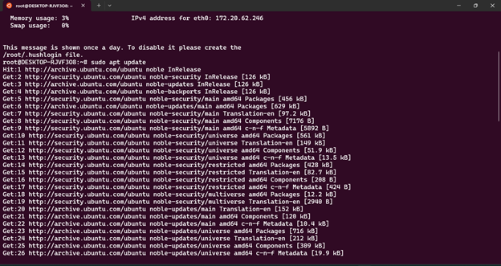
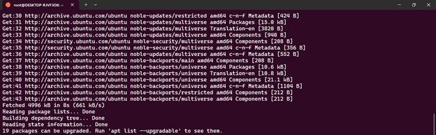

Installation of nginx

Step :1
Update the package
Command : sudo apt update

 
 
Step :2
Install nginx
Command : sudo apt install nginx
 

Step :3
Enable the nginx service
Command : sudo systemctl enable nginx
 
 

Step :4
Start the nginx service
Command : sudo nginx

 

Step :5
Observe the nginx process
Command: ps aux | grep nginx
It checks the running process
 
Step :6
Check the port used by nginx
Find out which port nginx is listenting on
Command: sudo lsof -i -P -n | grep LISTEN | grep nginx
 

Step :7
Stop the nginx service
Command : sudo nginx -s stop
 

Step :8
Start the nginx service again
Command: sudo nginx

Step :9
Kill the nginx process
To manually kill ngnix process first find out the process ID (PID)
Command: ps aux | grep nginx
pidof nginx
sudo kill -TERM <PID>
 
